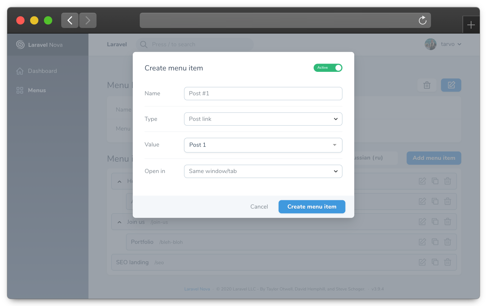

# Nova Menu Builder

This [Laravel Nova](https://nova.laravel.com/) package allows you to create and manage menus and menu items.

Continuation of [Infinety/Nova-Menu-Builder](https://github.com/InfinetyEs/Nova-Menu-Builder). As opposed to the menu builder by InfinityEs, this package is mainly targeted towards the creation of headless content management systems and expects data to be returned through an API.

## Features

- Managing menus (w/ customizable locales) and menu items
- Nesting and re-ordering of menu-items
- Creation of custom link options (ie links to models such as Page or Product)

## Screenshots




## Installation

Install the package in a Laravel Nova project via Composer:

```bash
composer require optimistdigital/nova-menu-builder
```

Publish the database migration(s) and run migrate:

```bash
php artisan vendor:publish --tag=nova-menu-builder-migrations
php artisan migrate
```

Optionally you can publish menu template and configuration:

```bash
php artisan vendor:publish --tag=nova-menu-builder-views
php artisan vendor:publish --tag=nova-menu-builder-config
```

With configuration you can customize resource controller. To avoid controller double-loading [nova-issues #1928](https://github.com/laravel/nova-issues/issues/1928) create it outside of `App\Nova` directory:

```php
// create app/Menus/MenuResource.php:

namespace App\Menus;

use OptimistDigital\MenuBuilder\Http\Resources\MenuResource as BaseMenu;

class MenuResource extends BaseMenu {}

// in config/nova-menu.php:

use App\Menus\MenuResource;

return [
    'resource' => MenuResource::class,
];
```

Register the tool with Nova in the `tools()` method of the `NovaServiceProvider`:

```php
// in app/Providers/NovaServiceProvider.php

public function tools()
{
    return [
        // ...
        new \OptimistDigital\MenuBuilder\MenuBuilder(),
    ];
}
```

## Usage

### Custom `MenuLinkable` classes

Nova menu builder allows you to create a select field for custom models (ie Pages or Products).

First, create a class that extends the `OptimistDigital\MenuBuilder\Classes\MenuLinkable` class.

Secondly, register the class in the constructor of `MenuBuilder` in `NovaServiceProvider`'s `tools()` function like so:

```php
// in app/Providers/NovaServiceProvider.php

public function tools()
{
    return [
        // ...
        new \OptimistDigital\MenuBuilder\MenuBuilder([
            'linkable_models' => [
                \App\Classes\CustomMenuLinkable::class,
            ],
            'locales' => null, // Optional, default is ['en_US' => 'English']
        ]),
    ];
}
```

In the created class, overwrite the following methods:

```php
/**
 * Get the menu link identifier that can be used to tell different custom
 * links apart (ie 'page' or 'product').
 *
 * @return string
 **/
public static function getIdentifier(): string {
    // Example usecase
    // return 'page';
    return '';
}


/**
 * Get menu link name shown in  a dropdown in CMS when selecting link type
 * ie ('Product Link').
 *
 * @return string
 **/
public static function getName(): string {
    // Example usecase
    // return 'Page Link';
    return '';
}


/**
 * Get list of options shown in a select dropdown.
 *
 * Should be a map of [key => value, ...], where key is a unique identifier
 * and value is the displayed string.
 *
 * @return array
 **/
public static function getOptions($locale): array {
    // Example usecase
    // return Page::all()->pluck('name', 'id')->toArray();
    return [];
}

/**
 * Get the subtitle value shown in CMS menu items list.
 *
 * @param string $value
 * @return string
 **/
public static function getDisplayValue($value = null) {
    // Example usecase
    // return 'Page: ' . Page::find($value)->name;
    return $value;
}

/**
 * Get the value of the link visible to the front-end.
 *
 * Can be anything. It is up to you how you will handle parsing it.
 *
 * @param string $value The key from options list that was selected.
 * @param array $parameters The JSON parameters added to the item.
 * @return any
 **/
public static function getValue($value = null, array $parameters = null) {
    // Example usecase
    // return Page::find($value);
    return $value;
}
```

### Returning the menus in a JSON API

#### nova_get_menus()

A helper function `nova_get_menus` is globally registered in this package which returns all the menus including their menu items in an API friendly format.

```php
public function getMenus(Request $request) {
    $menusResponse = nova_get_menus();
    return response()->json($menusResponse);
}
```

#### nova_get_menu(\$menuSlug)

To get a single menu, you can use the helper function `nova_get_menu('slug')`. Returns null if no menu with the slug is found or returns the menu if it is found.

### Menu locale options

To define locales that you can select for your menus, please register them in the constructor of `MenuBuilder` in `NovaServiceProvider`'s `tools()` function:

```php
// in app/Providers/NovaServiceProvider.php

public function tools()
{
    return [
        // ...
        new \OptimistDigital\MenuBuilder\MenuBuilder([
            'linkable_models' => null, // Optional
            'locales' => [
               'en_US' => 'English',
               'et_EE' => 'Estonian',
            ],
        ]),
    ];
}
```

## Credits

- [Tarvo Reinpalu](https://github.com/Tarpsvo)
- [Eric Lagarda (original nova-menu-builder)](https://github.com/Krato)
- [Ralph Huwiler (vue-nestable)](https://github.com/rhwilr/vue-nestable)

## License

Nova menu builder is open-sourced software licensed under the [MIT license](LICENSE.md).
